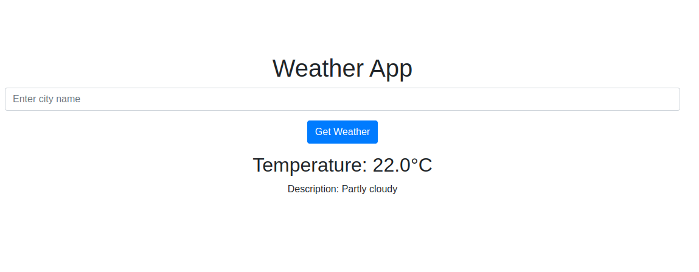

# WeatherApp
# Flask Weather App

This is a simple weather app built with Flask that allows users to retrieve weather information for a specific city using the WeatherAPI.com API.

## Prerequisites

Before running the app, make sure you have the following:

- Python 3 installed
- Flask package installed (`pip install flask`)
- API key from WeatherAPI.com. You can sign up for an account and obtain an API key at [https://www.weatherapi.com](https://www.weatherapi.com)

## Getting Started

1. Clone the repository or download the code.

2. Install the required packages by running the following command:

```pip install -r requirements.txt```

3. Replace `YOUR_API_KEY` in `app.py` with your actual WeatherAPI.com API key.

4. Run the app using the following command:

``` python app.py ```

5. Open your web browser and go to `http://localhost:5000` to access the weather app.

## Usage

1. Enter the name of a city in the provided input field.

2. Click the "Get Weather" button to retrieve the weather information for the specified city.

3. The app will display the temperature and weather description for the city, if available. If there is an error fetching the data, an error message will be displayed.

### Before Request



### After Request


## License

This project is licensed under the [MIT License](LICENSE).

